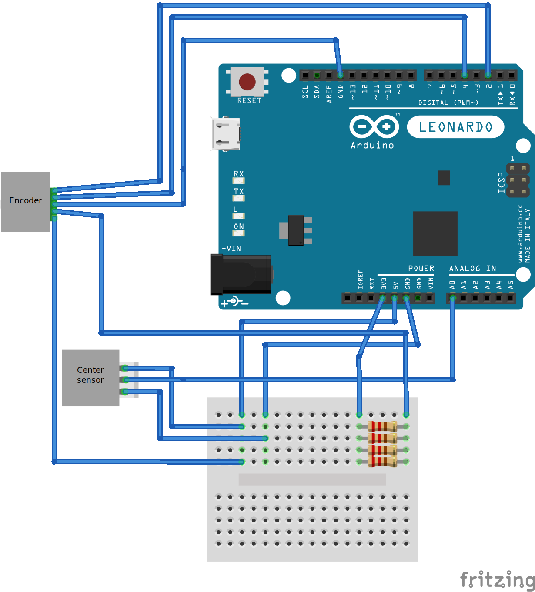

# arduino-momo

Logitech Momo with Arduino LEONARDO as a USB interface (Linux distributions only)

# Intro / Disclaimer

First of all. This project was made because the decade-old Logitech Momo of author had a faulty sensor and wasn't able to center the wheel. Also it was made just for fun, just to tinker with Momo's sensors. So don't expect that presented solution will cover all of wheel's functionality. Don't expect it to be bug-free as well.

# Idea and hardware implementation
What was intended to be implemented was reading of center sensor and encoder outputs of the wheel, so the code running in Arduino would map the wheel position into some value of a virtual Joystick.  That's it. This solution does not support Force Feedback, actually it is necessary to unplug the connector of FF motor.

## Center sensor reading

The center sensor has 3 PINs:

* red - power, 5V;
* green - sensor inverted output, : range: 0-1023 if connected to analog PIN, it is normally  outputs high value (1023), unless the metal plate on the wheel is close to the sensor (yields 0 in this case);
* black - ground;

## Encoder
Encoder has a wheel with holes and a photoresistor sensor that outputs 2 types of values (A, B) to track speed and direction.
Encoder need 5 pins for following:

* yellow - ground;
* green - power, 5V;
* red - photoresistor power (current 5.5 mA, voltage drop 1.16V, what worked for me was connecting a 3.3V input from Arduino via 600 Om resistor on a breadboard);
* black and white - A and B outputs of encoder.

## Fritzing Scheme



# Using

## Dependencies
Install https://github.com/MHeironimus/ArduinoJoystickLibrary in Arduino Studio to compile the sketch

## Connecting

Unfortunately, wheel buttons and pedals in this rather simple project cannot be  connected to Arduino, so we need total of two USB connections to connect the whole solution: first will connect Momo and second will connect Arduino.


## Initializing procedure

First, the Momo USB is connected. Then, after connecting Arduino, it will be in the initializing phase. Due to this, before connecting Arduino, the wheel need to be turned full left. Then, after connecting, it should be steered with constant speed to full right, and then to full left again (same procedure is performed by Momo's software, but automatically using FF).

## Running

To use the wheel, it is convenient to map it as Xbox controller, using, for example  xboxdrv (example from Ubuntu):

```
sudo xboxdrv --evdev /dev/input/by-id/usb-Arduino-LLC_Arduino_Leonardo_HIDJD-event --detach-kernel-driver --silent --evdev-absmap ABS_X=x1,ABS_Y=y1
```
This need to be executed AFTER initialization phase. To check the inputs, jstest-gtk application can be used.

## Acknowledgments
MHeironimus for his amazing [Arduino Joystick library](https://github.com/MHeironimus/ArduinoJoystickLibrary)

# License

MIT License
